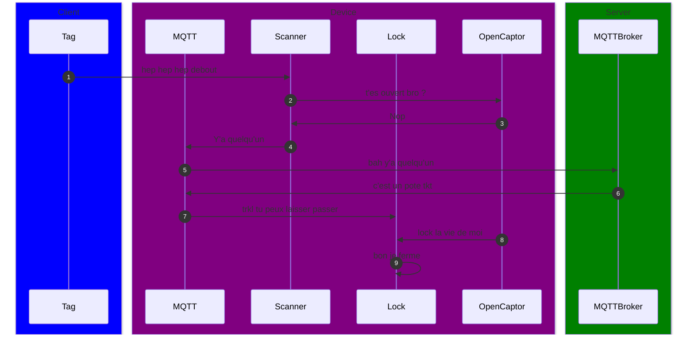

RFID Diagram

```mermaid
sequenceDiagram
    autonumber

    box Blue Client

        participant Tag

    end

    box Purple Device

        participant MQTT
        participant Scanner
        participant Lock
        participant OpenCaptor

    end

    box Green Server

        participant MQTTBroker

    end

    Tag ->> Scanner : hep hep hep debout
    Scanner ->> OpenCaptor : t'es ouvert bro ?
    OpenCaptor ->> Scanner : Nop
    Scanner ->> MQTT : Y'a quelqu'un
    MQTT ->> MQTTBroker : bah y'a quelqu'un
    MQTTBroker ->> MQTT : c'est un pote tkt
    MQTT ->> Lock : trkl tu peux laisser passer
    OpenCaptor ->> Lock : lock la vie de moi
    Lock ->> Lock : bon je ferme

```